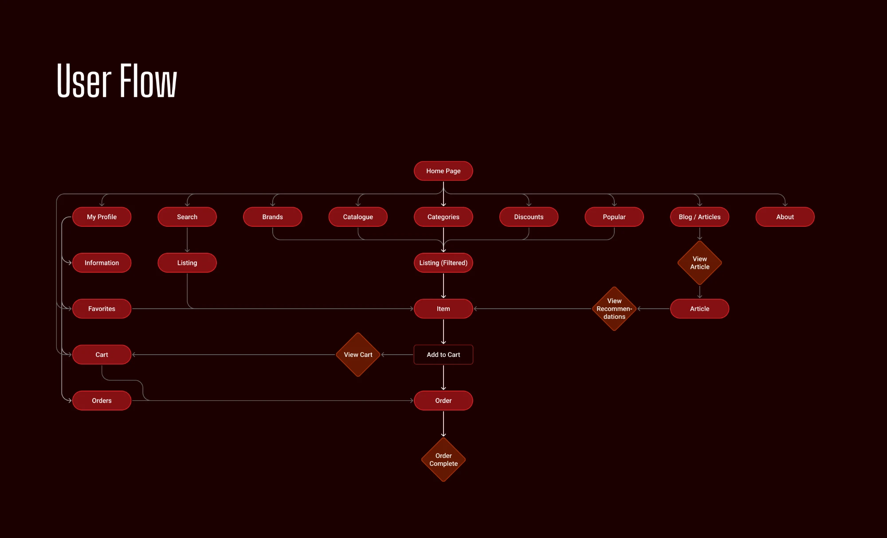
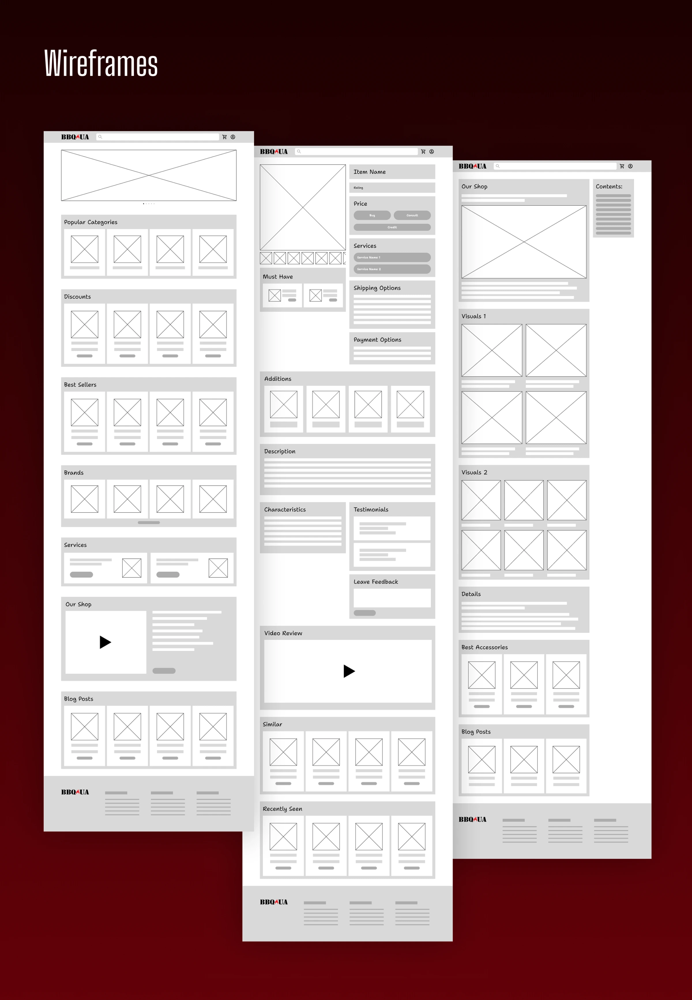
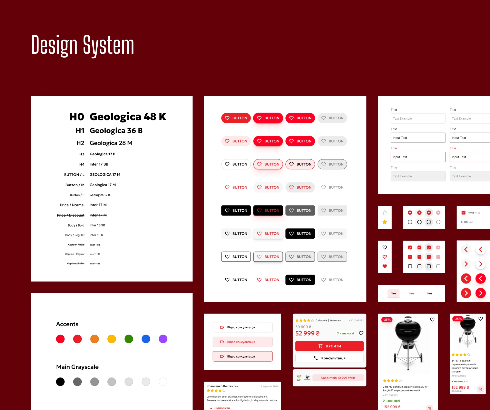
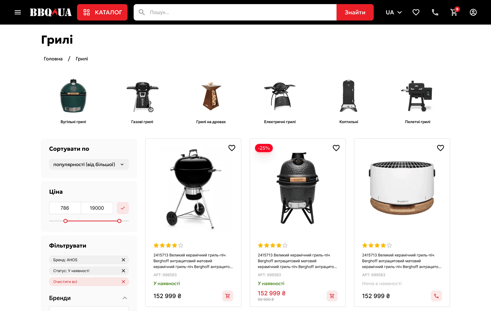
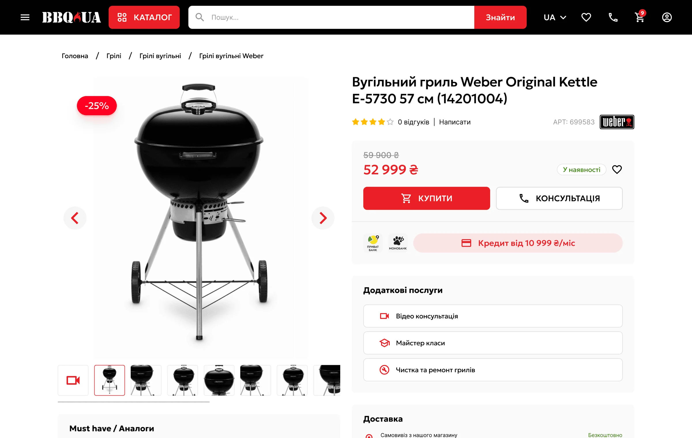
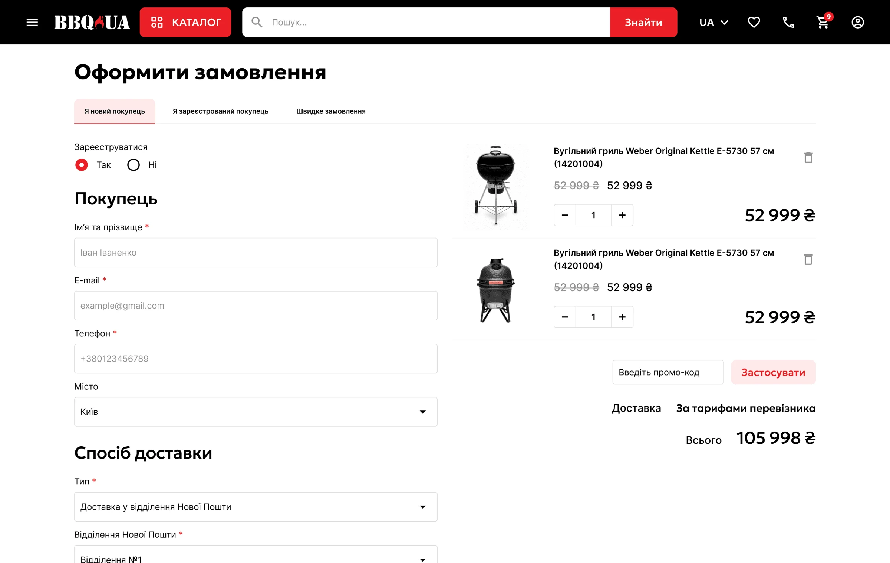
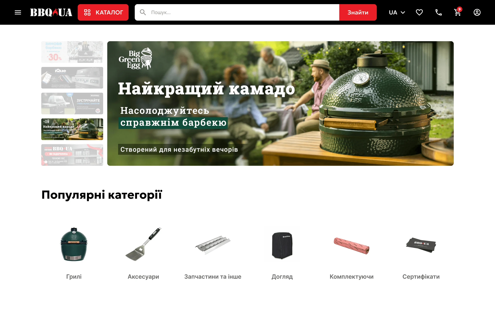
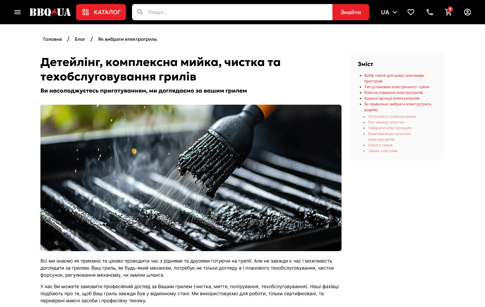
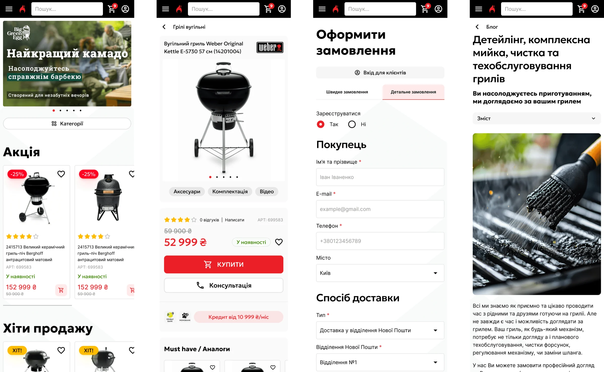

## Problem

### Customers liked the products, not the shopping

I ran interviews with existing customers, a competitive analysis of modern e-commerce sites and usability tests of the current store.

- The design felt outdated and cluttered.
- Filtering and sorting were not intuitive, so people couldn’t find the right grill.
- Checkout was long and required too many steps.
- Recommendations were appreciated but not personal enough.
- New buyers wanted guidance: video tutorials and care tips.

## Focus

### Four problems to solve

<b>Navigation</b>Poor filtering and categorisation made products hard to find.

<b>Checkout friction</b>A lengthy purchase flow led to drop-offs.

<b>Trust</b>Reviews, testimonials and video guides were buried.

<b>Mobile</b>The phone experience was inconsistent and hard to use.

## Users

### Meet Andrii, the primary user

<dl class="persona__id">

<dt>Name</dt><dd>Andrii Melnyk, 38</dd>

<dt>Occupation</dt><dd>Project manager in an IT company</dd>

<dt>Location</dt><dd>Kyiv, UA</dd>

</dl>

Andrii is a family-oriented professional living in a suburban house near Kyiv. He enjoys spending weekends grilling with friends and family in his backyard. With a busy work schedule, he prefers online shopping that’s fast, clear and reliable. He values expert advice, quality equipment and services that save him time.

Goals

<ul>
<li>Buy a reliable grill and quality accessories with minimal hassle.</li>
<li>Learn how to properly maintain and clean his grill to make it last longer.</li>
<li>Get trustworthy advice and recommendations before making a purchase.</li>
</ul>

Frustrations

<ul>
<li>Overwhelming or outdated website designs that make it hard to find the right product.</li>
<li>Lack of detailed, trustworthy information like real reviews or expert tips.</li>
<li>Complicated checkout processes that require unnecessary steps or registration.</li>
</ul>

How BBQ.ua helps

<ul>
<li>Modern, clean design with intuitive navigation and filters to help him find exactly what he needs fast.</li>
<li>Video consultations and cleaning tips available right on the product page to give him confidence in his purchase and maintenance.</li>
<li>Streamlined checkout with multiple payment options and guest checkout so he can buy quickly without creating an account.</li>
</ul>

### His path through the store

<ol class="flow">
<li>01 · HomeLands on the store</li>
<li>02 · FindBrowses categories or searches</li>
<li>03 · NarrowFilters the listing</li>
<li>04 · ItemChecks photos, video and details</li>
<li>05 · CartAdds the grill</li>
<li class="is-accent">06 · OrderChecks out as a guest</li>
<li>07 · ResultOrder complete</li>
</ol>

## Process

### Flow first, then wireframes

The user flow maps the journey from discovery to order, keeping the path from the home page to checkout as short and direct as possible.

## Design system

### Warm, bold and built to scale

A responsive component set, adaptive type scale and a warm palette that feels like an evening by the grill — consistent on desktop and mobile.

## Key decisions

### What changed

#### Filters people actually use

The listing page got clear categories, visual sub-categories and filters for price, availability, type and material — so a buyer narrows hundreds of grills down in a few taps.

#### A product page that answers questions before they’re asked

Photos, buying options and extra services sit together, with video consultations and cleaning tips right on the page for people who are new to grilling.

#### Checkout without an account

Guest checkout, multiple payment options and a single clear path to “place order” replaced the old multi-step flow.

## Final screens

### Desktop and mobile

*Home — featured categories, best sellers and blog in one scroll.*

*Services — cleaning and maintenance, sold alongside the products.*

*Mobile — stacked layout, swipeable carousels and large touch targets.*

## Testing

### What users told us

In usability testing with a small group, people found the new layout easier to navigate, found products faster with the new filters, and got through checkout with fewer drop-offs. Two things came back for another round: more hierarchy in product descriptions and a more visible customer-service section — both fixed in the final design, along with contrast and micro-interaction polish.
