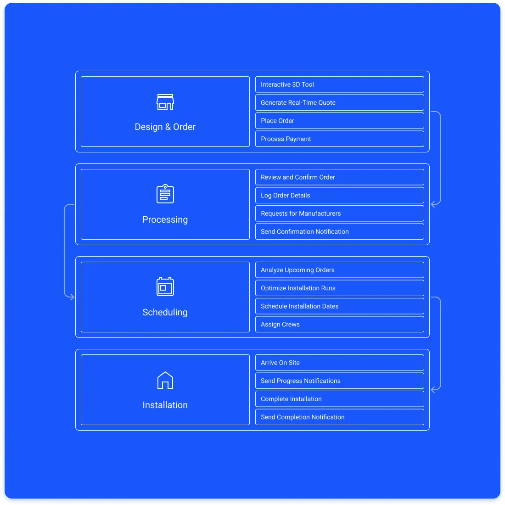
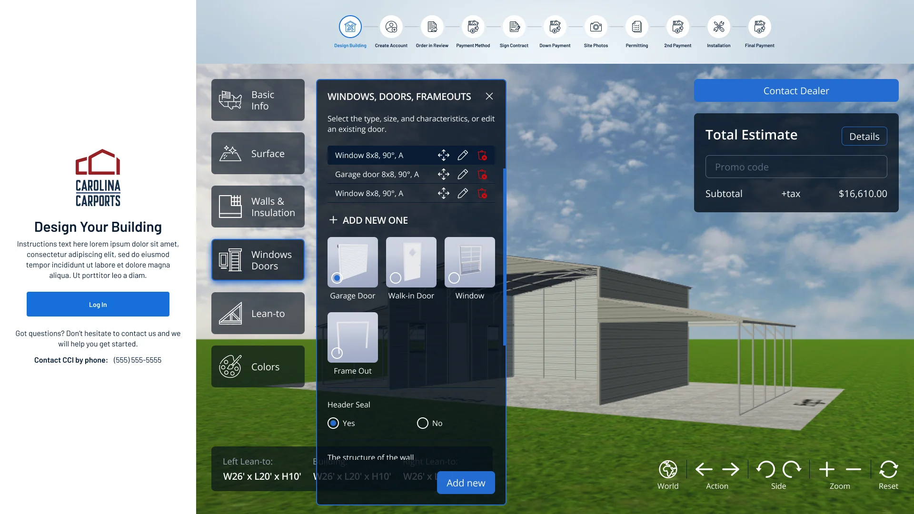
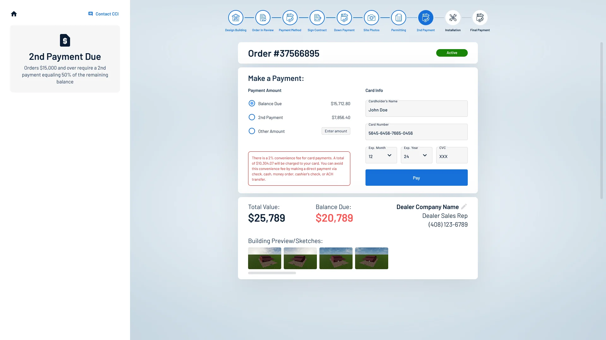
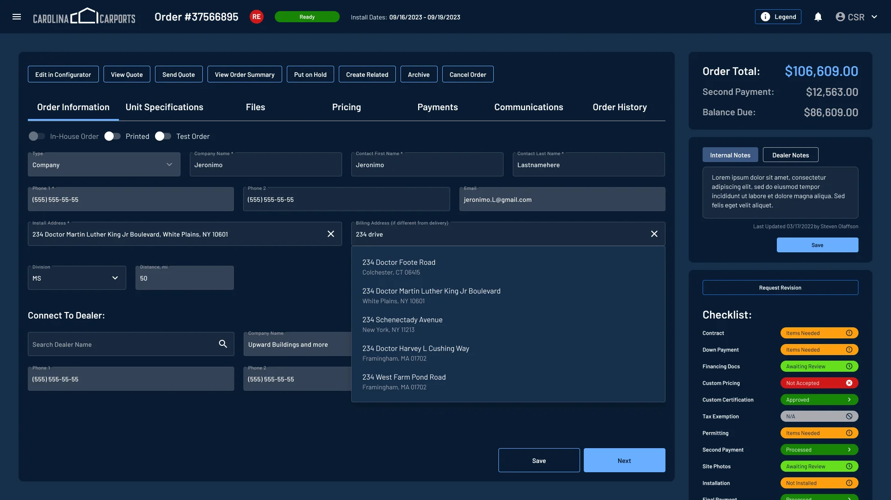
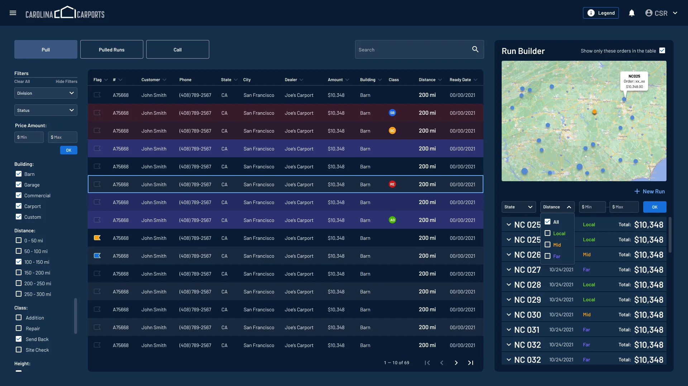
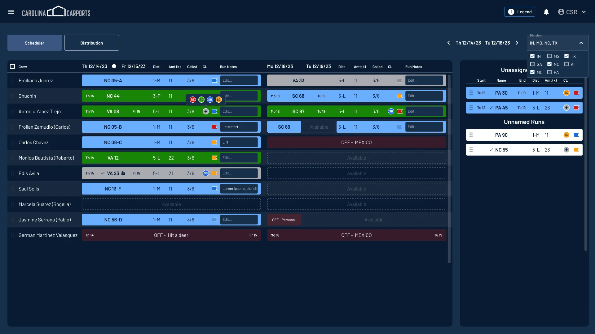
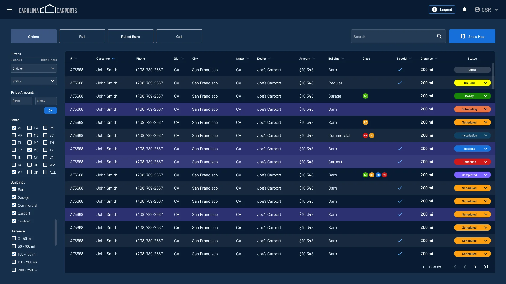
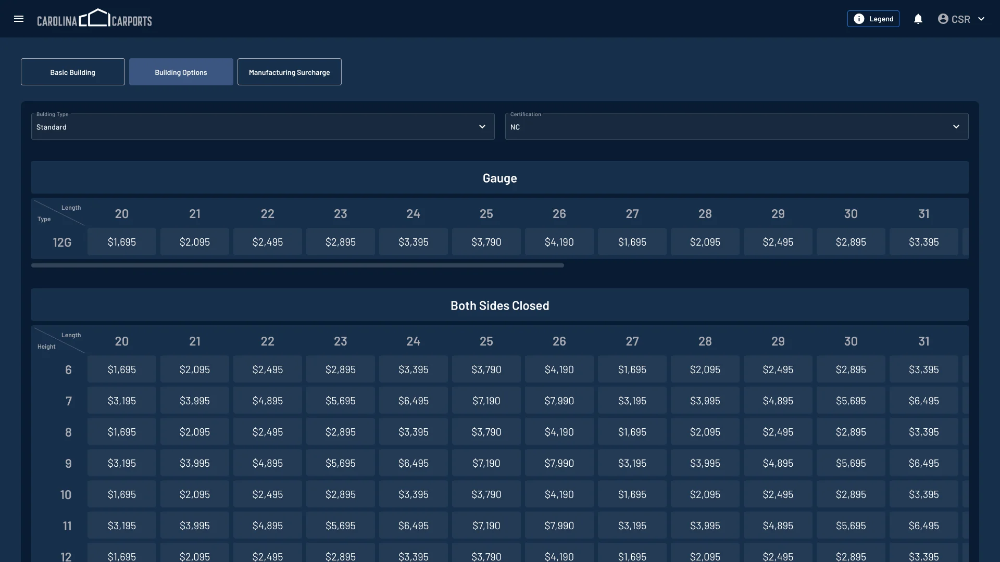
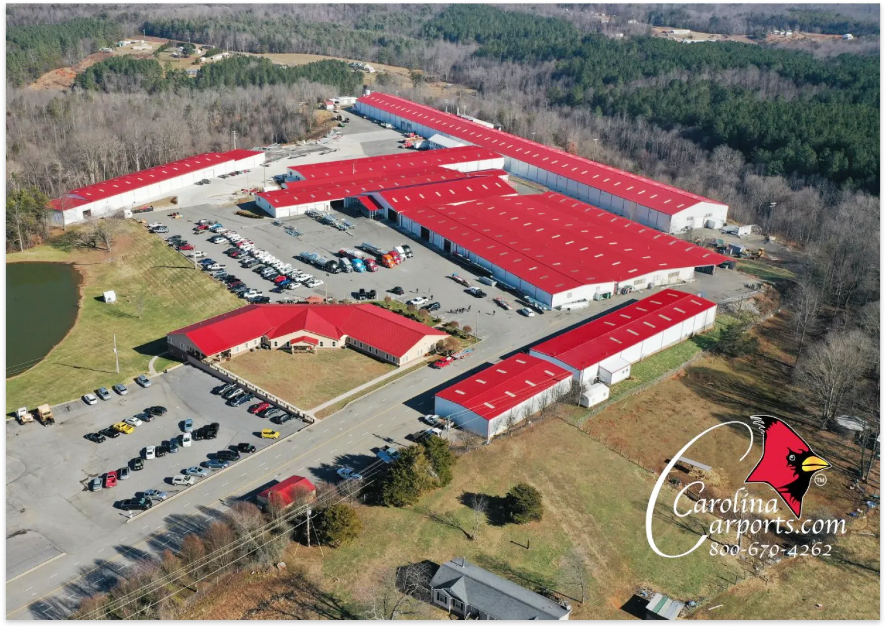

## Overview

### From spreadsheets to one platform

CCI ERP is a web platform that covers the whole life of a carport building — creating, selling and installing it. It is made for carport manufacturers, retailers and installers, and it re-creates the Excel tables the client had used for over 20 years.

I joined the discovery phase alongside business analysts, then designed more than 100 screens and pop-ups while the requirements kept evolving, working closely with developers through implementation. The work covered user research, wireframing and prototyping, visual design and iterative usability testing.

- **Design tool** — customers build a carport in 3D and see the price update in real time.
- **Order management** — sales track every order from quote to final payment.
- **Scheduling** — confirmed orders become installation jobs grouped by region and crew.
- **Admin tools** — inventory, users and pricing in one place.

## Workflow

### Four stages, from design to installation

1. **Design & order**
   - Customers use the interactive 3D tool to design their carport.
   - The system generates a real-time quote and allows the customer to place an order.
   - Payment is processed through the integrated gateway.
2. **Order processing**
   - The order is reviewed and confirmed by the sales team.
   - The order details are logged into the system, and the customer receives a confirmation notification.
   - Order specials requested from manufacturers to produce and prepare.
3. **Scheduling installation**
   - System managers analyze upcoming orders and optimize installation runs based on location and crew availability.
   - Installation dates are scheduled and added to the calendar.
   - Crew members receive their assignments and necessary details.
4. **Installation**
   - The installation team arrives on-site and completes the installation as per the specifications.
   - Customers receive notifications about the progress and completion of the installation.

## Key features

### Five parts of one system

#### Carport design tool

Customers design a carport in an interactive 3D view, one option group at a time — basic info, surface, walls and insulation, windows and doors, lean-tos and colors. A stepper at the top shows where the order is, from design to final payment.

- **Interactive 3D designer** — users can design custom carports using an intuitive 3D interface: dimensions, materials, roof styles, colors and numerous additional features.
- **Real-time pricing** — as users modify the design, the price updates instantly, providing immediate cost estimates.
- **Save designs** — customers can save their designs to their accounts and print detailed specifications.
- Accessible for both manager and customer.

#### Customer portal

After the design is finished, the customer follows the order in a portal: what is due now, what has been paid, and what comes next.

- **Configurator** — the 3D carport design tool from the previous step.
- **Order history** — customers can view their order history, including past designs, current order statuses and upcoming installations.
- **Notifications** — automatic notifications for order updates, schedule changes and upcoming installations, by email and in the app.
- **Mobile version** — created to track the order status on the go and to provide additional info from both sides.

#### Order management system

Once the design is finalized, sales staff work with the order in a dark, dense workspace: tabs for information, specifications, files, pricing, payments, communications and history, with the totals, notes and an approval checklist always in view on the right.

- **Order creation** — users can create a detailed order, including all specifications, pricing and customer information.
- **Order tracking** — status updates on orders from creation to fulfillment. Customers and staff can track the progress in real time.
- **Payment integration** — secure payment gateway integration to handle transactions, including deposits and final payments.

#### Scheduling and installation management

Confirmed orders are pulled into runs and placed on a calendar of crews.

- **Run creation** — after an order is confirmed, the system helps create installation runs, grouping nearby orders for efficient scheduling.
- **Installer management** — assign specific tasks and installations to available crews, ensuring optimal use of labor and minimizing downtime.
- **Unassignation** — remove crews from their tasks, create OFF-dates, reassign to another installer.

#### Administrative tools

Everything that keeps the system running sits behind the same navigation.

- **Inventory management** — tracks materials and inventory levels, automatically updating as orders are placed and fulfilled.
- **User management** — controls access and permissions for staff, ensuring that sensitive information is only available to authorized personnel.
- **Pricing management** — allows to set, adjust and manage building options, discounts and manufacturing surcharge, ensuring accurate and competitive quotes for clients.

## Results

### One platform for the whole business

- **Efficiency** — streamlines the design-to-installation process, reducing lead times and increasing productivity.
- **Customer satisfaction** — enhances customer experience with real-time updates and a user-friendly interface.
- **Cost savings** — optimizes resource allocation and reduces travel time for installation crews.
- **Scalability** — supports businesses of all sizes, from small retailers to large manufacturers.

CCI ERP is designed to be a robust solution, addressing the needs of the carport industry by integrating design, sales and installation management into a single, cohesive platform.

