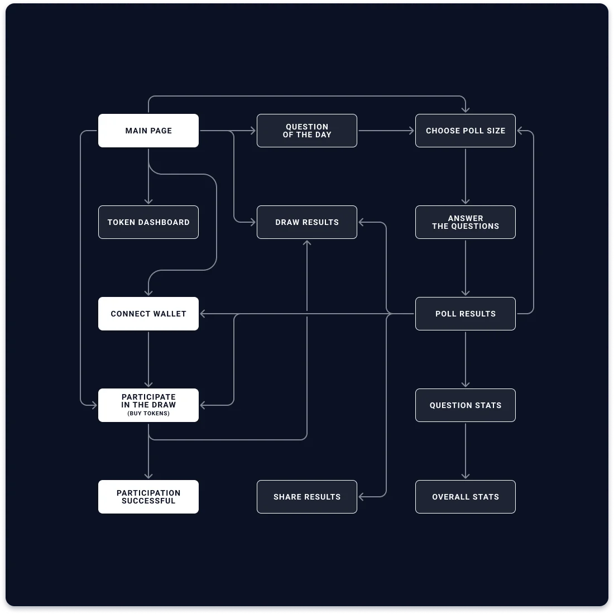
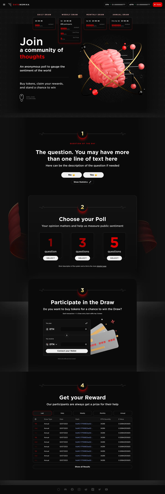
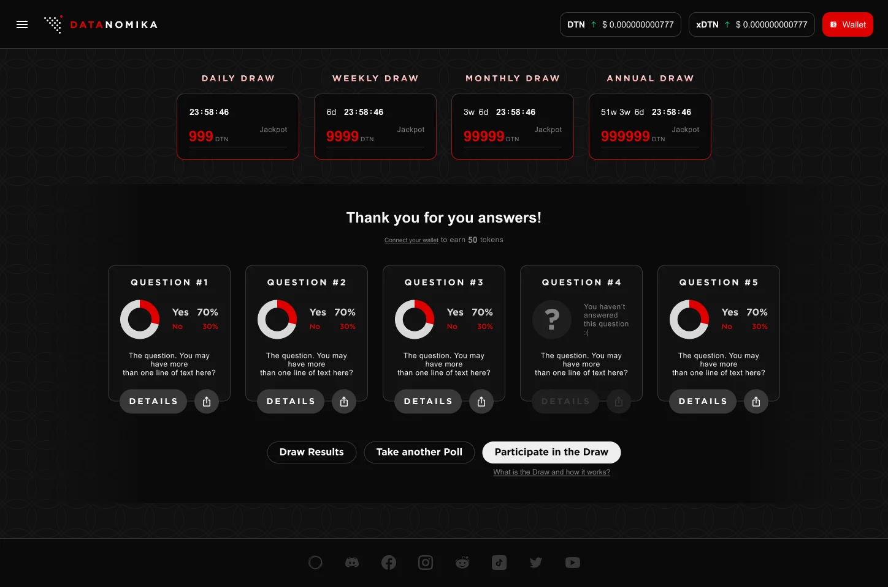
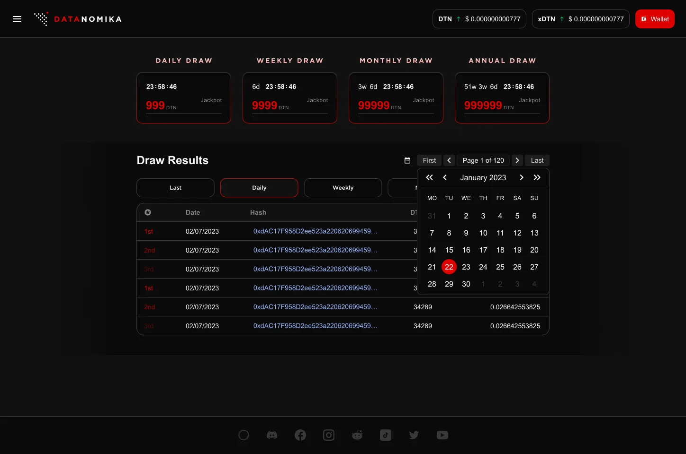
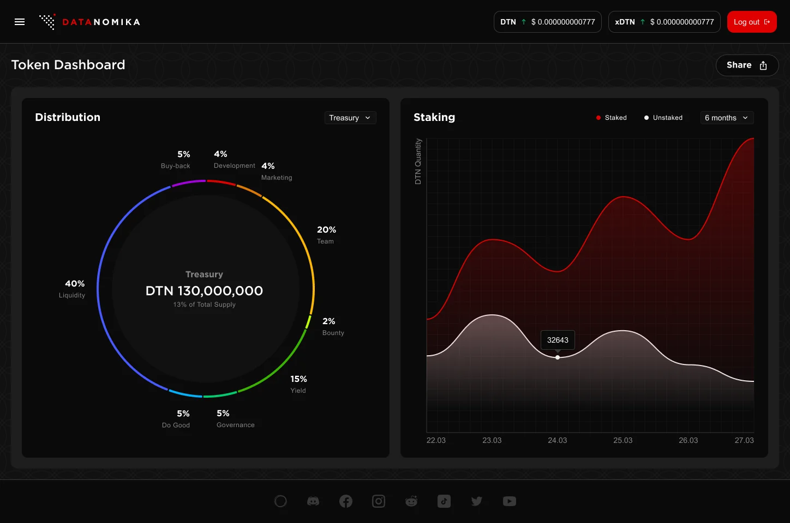
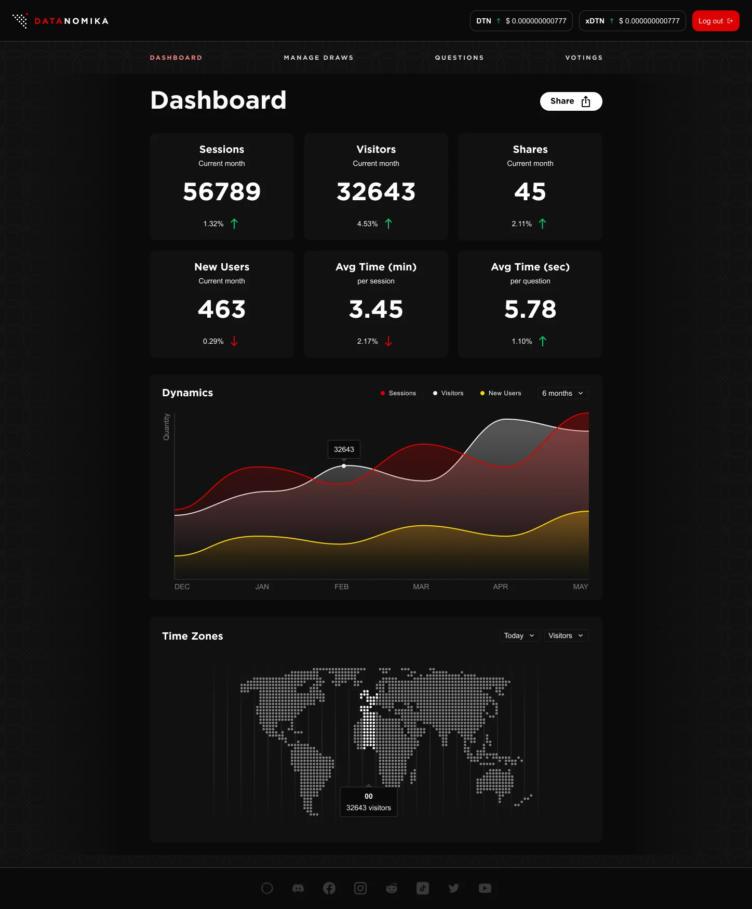
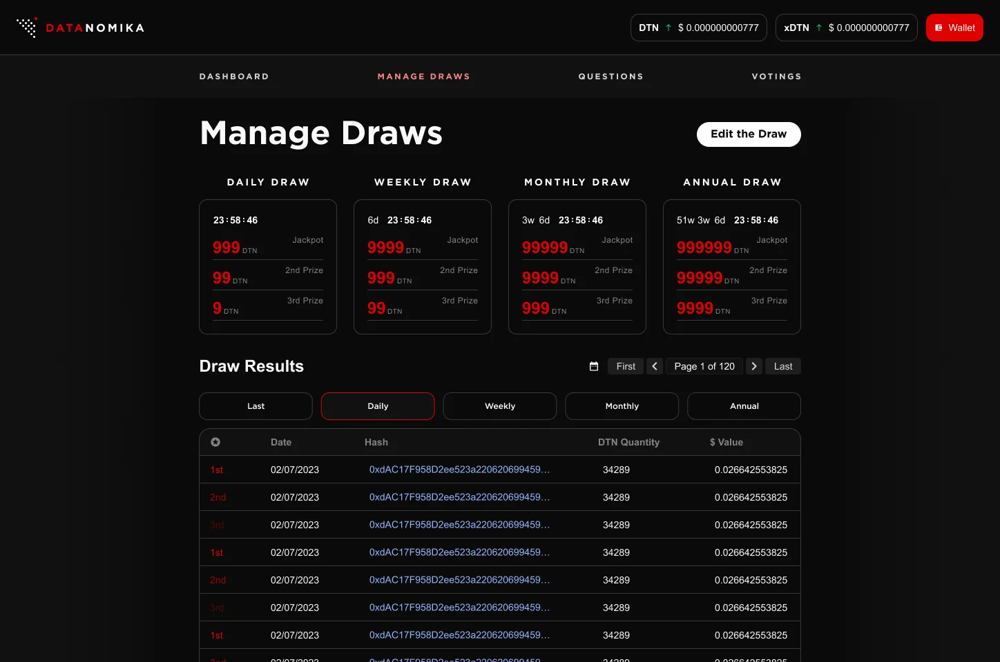
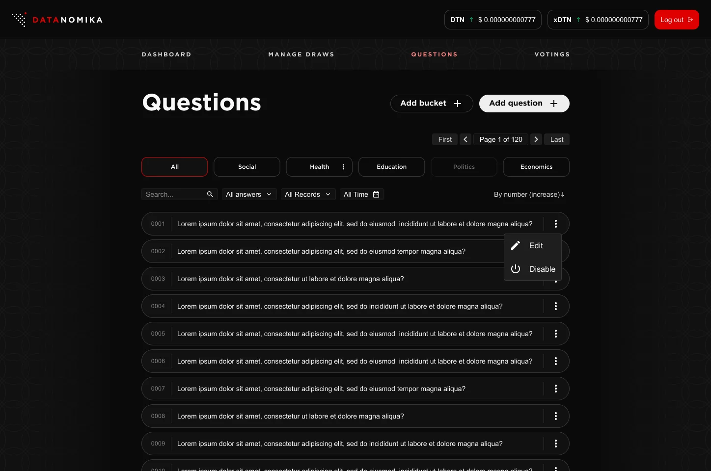
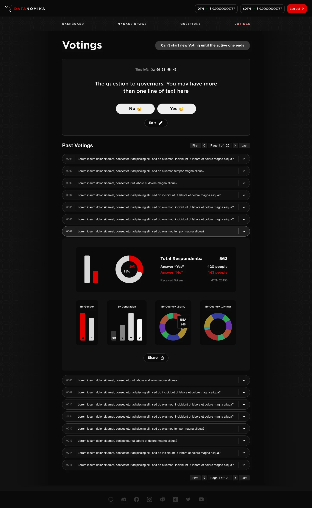

## Overview

### Polling, with a reason to come back

I took part in discovery as a business analyst, then designed the whole product — the public site and the admin panel — iterating with the customer until the final result.

- **Question of the day** — a single yes/no question gets people in, then they choose one, three or five more.
- **Rewards** — every answer earns tokens; tokens are entries in the draws.
- **Transparency** — blockchain keeps the draws and rewards verifiable.
- **Admin panel** — separate tools to manage draws, polls and questions, grouped into themes, with a dashboard of key metrics.

The project wound down when its funding ran out.

## User flow

### Give them something “for free”

The flow’s main purpose is to make users buy tokens. And how to force someone to do anything? Right — give them something “for free”.

The poll engine was created together with the raffle system: the more users interact with the questions, the higher their chances of winning a draw. Starting from the main page, they answer the question of the day, choose a poll size and answer additional questions to increase their chances. Then they connect a wallet and buy tokens to participate in the draw, with options to view the results and share their participation.

## Public site

### A step-by-step path to the draw

#### Main page

Users follow a step-by-step process to participate in polls and raffles.

1. **Question of the day** — users answer a daily question with “Yes” or “No” and can view the related statistics.
2. **Choose your poll** — users select from options like 1, 3 or 5 questions to answer.
3. **Participate in the draw** — users connect their cryptocurrency wallet, buy tokens with ETH or USDT and receive DTN tokens for raffle entries.
4. **Get your reward** — displays past raffle results, including draw type, date, transaction hash, DTN quantity and value.

#### Polls

- Users see polls divided by number of questions.
- They select a poll and provide their responses.
- Each completed poll response earns the user a set number of free tokens.
- Users may skip questions but won’t get any reward for them.
- Users accumulate tokens, which increase their chances in the upcoming draws.

#### Token info

This dashboard gives users an at-a-glance understanding of the token’s allocation and staking dynamics, enabling informed decisions about their investments and participation in the ecosystem.

A circular chart visualizes the distribution of DTN tokens. The line chart shows the quantity of DTN tokens staked and unstaked over time.

## Admin panel

### Tools for the poll engine and the raffle system

A separate module for managing the poll engine and the raffle system. It provides tools to create and edit draws, voting polls and questions, while offering visual data through charts and graphs.

The questions are divided into “buckets” that represent different themes — Social, Health, Education, Politics, Economics and so on. The dashboard delivers an overview of key metrics, efficient navigation and management of current and past activities.

