## Problem

### Creators were fighting leaks by hand — and losing

Leaked content means lost income, stress and damage to a creator’s reputation. Existing tools made creators find every copy and file every report themselves. Sites routinely ignored individual takedown requests, and few creators could afford lawyers.

> How might we detect, validate and remove leaked content automatically — with legal enforcement built in?

## Users and flow

### Three roles, one pipeline

<b>Creators and agencies</b>Protect content and revenue without technical skills or spare time.

<b>Operators</b>Review AI matches and remove false positives before anything goes legal.

<b>Lawyers</b>Receive validated cases and send takedowns at volume.

### Meet Emma, the primary user

<dl class="persona__id">

<dt>Name</dt><dd>Emma Carter, 28</dd>

<dt>Occupation</dt><dd>Full-time content creator</dd>

<dt>Location</dt><dd>Los Angeles, CA</dd>

</dl>

Emma has been a content creator for over three years, building a loyal fanbase and generating a stable income through subscriptions. Recently, she discovered her content was being leaked on various websites without her consent, impacting her revenue and personal well-being. She lacks the time and technical knowledge to manually track and report these violations.

Goals

<ul>
<li>Protect her content and revenue from unauthorized distribution.</li>
<li>Find an easy, automated way to detect and remove leaked content.</li>
<li>Maintain control over her brand and digital presence.</li>
</ul>

Frustrations

<ul>
<li>Manual takedown processes are slow and ineffective.</li>
<li>Many websites ignore her removal requests.</li>
<li>Emma feels vulnerable and lacks legal resources to fight back.</li>
</ul>

How LegalFans helps

<ul>
<li>Automatically scans and detects unauthorized use of her content.</li>
<li>Provides a seamless way to initiate legal takedown requests.</li>
<li>Gives her peace of mind by handling the enforcement process.</li>
</ul>

### Her path through the product

<ol class="flow">
<li>01 · CreatorSigns in securely</li>
<li>02 · CreatorLinks OnlyFans account</li>
<li>03 · CreatorInstalls the extension</li>
<li>04 · AIScans the web for copies</li>
<li class="is-accent">05 · OperatorValidates each match</li>
<li class="is-accent">06 · LawyerSends the takedown</li>
<li>07 · ResultLeak is removed</li>
</ol>

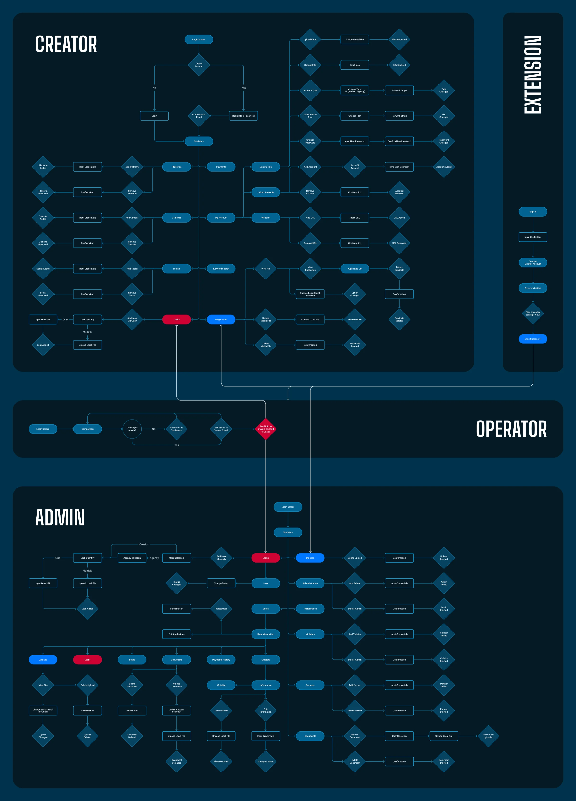

*Overall flow across the creator app, the browser extension, operators and admins.*

### First wireframes of the core screens

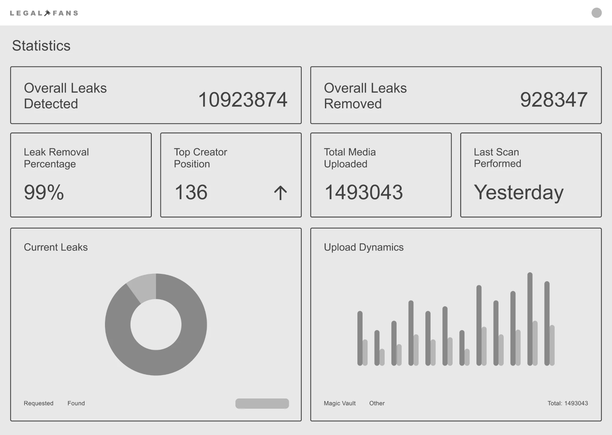

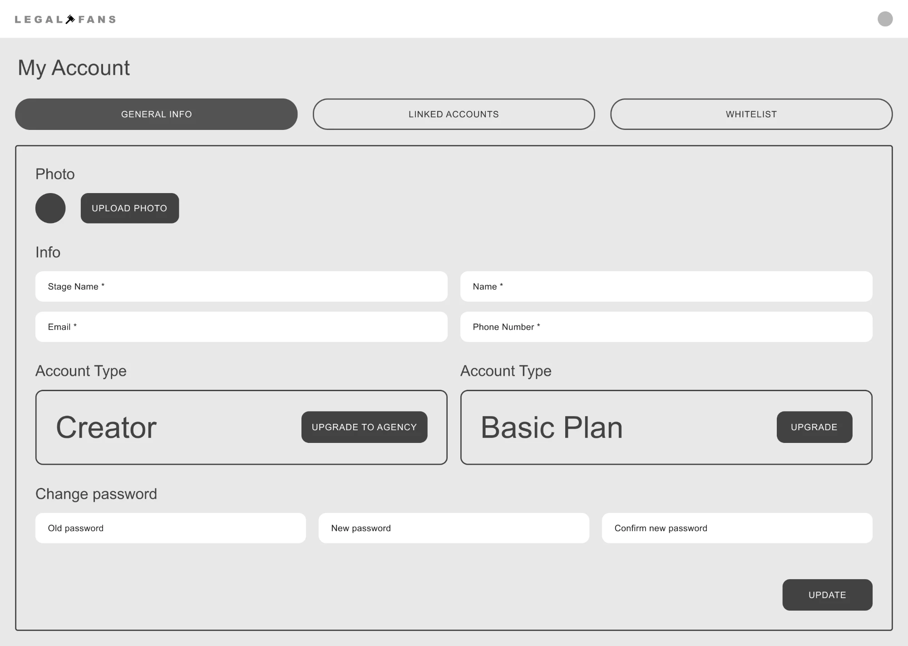

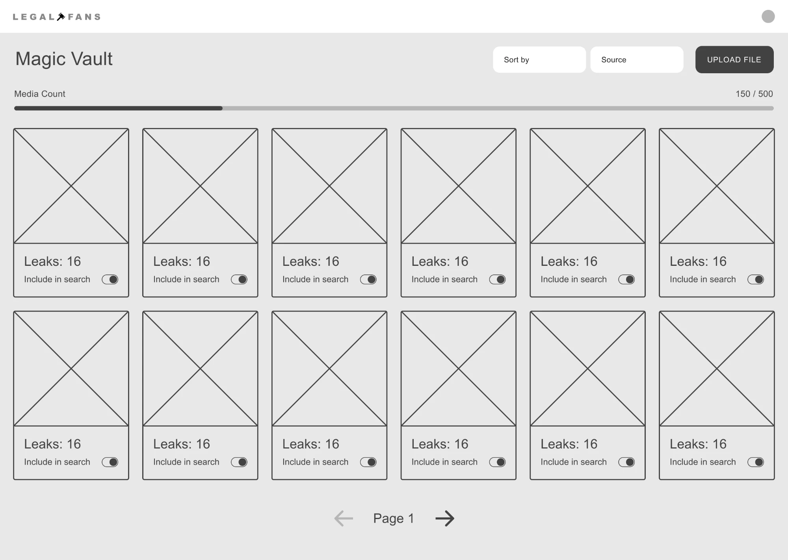

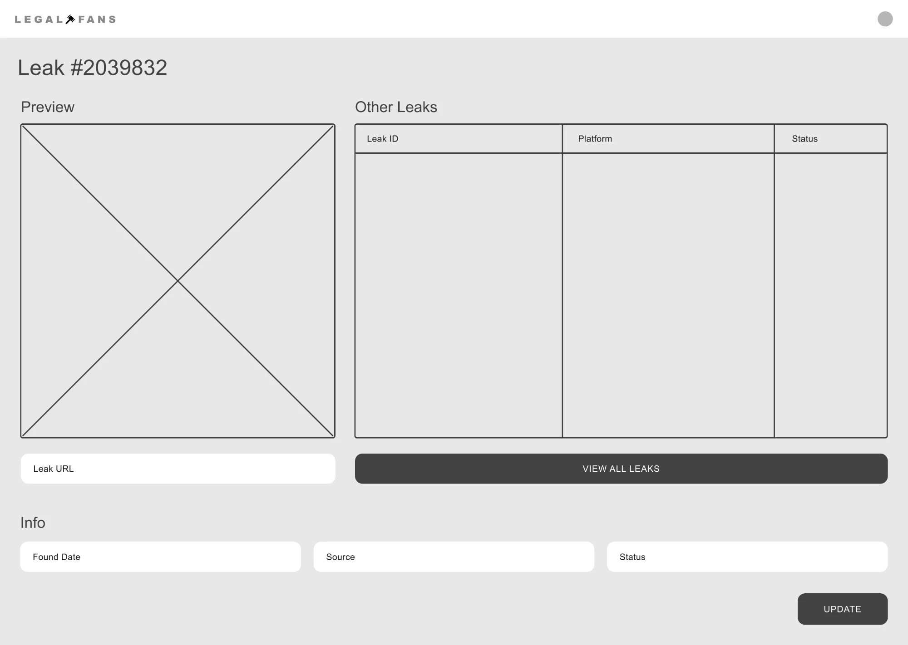

*Low-fidelity wireframes: the first pass focused on making every screen usable for non-technical creators.*

## Key decisions

### Three calls that shaped the product

#### AI finds, a human confirms

Fully automatic matching produced false positives, and a wrong takedown damages trust and creates legal risk. We added operator validation between detection and legal action, so every case a lawyer receives has already been checked by a person.

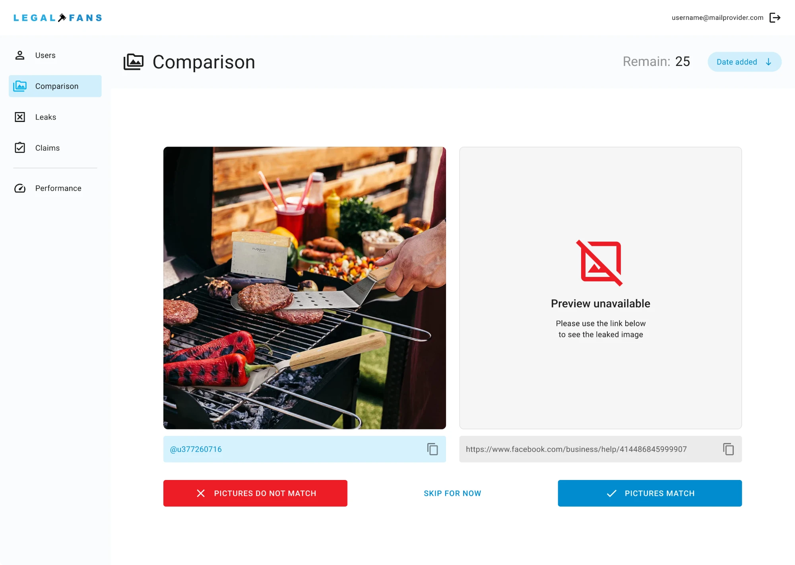

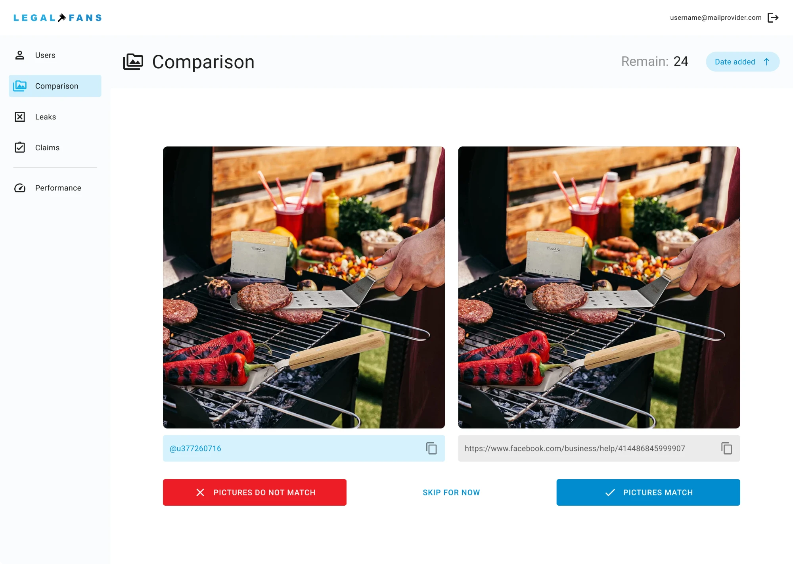

*Comparison view — the operator checks the original against the suspected copy before a case goes to a lawyer.*

#### A dashboard that answers one question: am I protected?

Creators don’t want to manage cases; they want to know they’re covered. The statistics view leads with leaks detected and removed, and keeps the legal detail one level down. Even the empty state explains what will appear there.

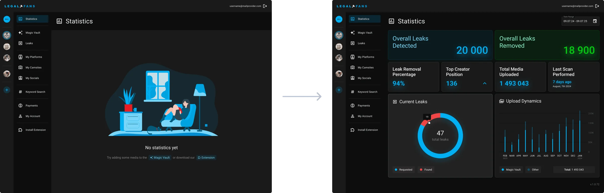

#### Guided setup for non-technical users

Connecting an account and installing an extension are where people give up. The extension walks creators through it step by step — connect, synchronise, done — and always shows how far along they are.

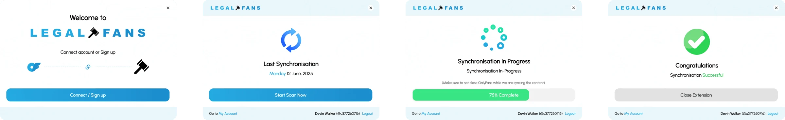

## Final screens

### The creator view

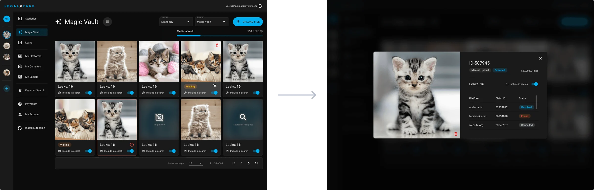

*Magic Vault — where creators add and manage all their content.*

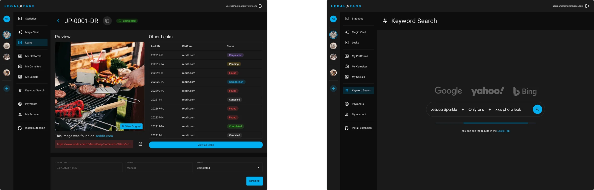

*Leaks and keyword search — one leak in detail, plus search by keyword.*

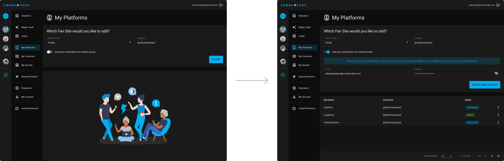

*My Platforms — cam sites and socials the team monitors on the creator’s behalf.*

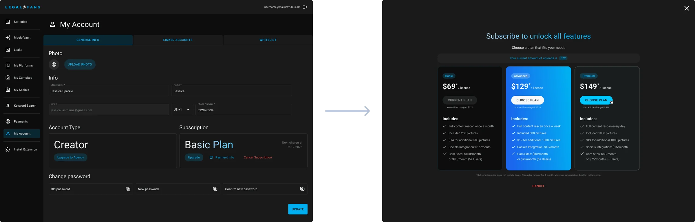

*My Account — profile and subscription upgrade.*

### The admin panel

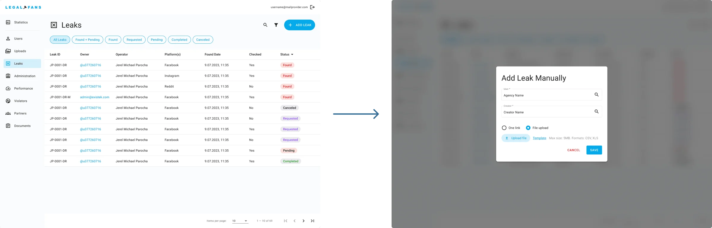

*Leaks — every detected copy in one list, with manual entry for anything the AI missed.*

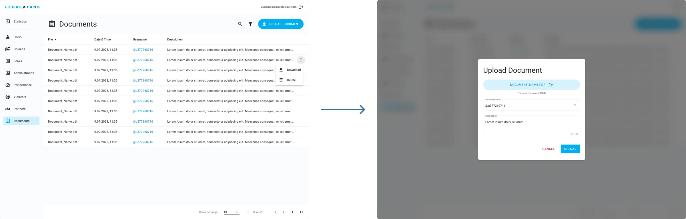

*Documents — the legal paperwork behind each takedown.*

## Lessons

### What I’d keep, and what I learned

<ol class="rows">
<li>Automation needs a human checkpoint. Speed means nothing if a wrong takedown costs trust.</li>
<li>Legal processes differ by jurisdiction, so the flow has to bend without breaking the creator’s view.</li>
<li>Showing progress openly — even “still in review” — builds more trust than silence.</li>
</ol>

Next on the roadmap: more accurate AI detection, more platforms and faster legal processing through further automation.
